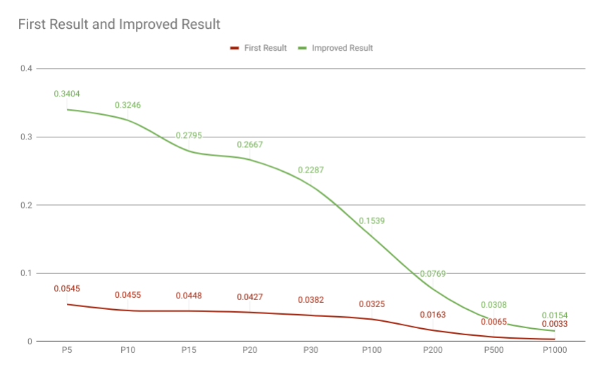

# A Simple tutorial of Galago Information Retrieval

## CMP269 Recuperação de Informações - UFRGS
##### Jonas Brunetto
This is a report of my effort to understand, configure, test and use the **Information Retrieval System Galago**. This work was done as part of CMP269 discipline offered by UFRGS.

#### Index


#### 1 - Introduction
Galago is a toolkit for experimenting with text search. It is based on small, pluggable components that are easy to replace and change, both during indexing and during retrieval.

The Galago Search Engine was originally released as part of "Search Engine, Information Retrieval in Practice" and the Lemur project extends the Galago Search Engine for **research purposes**.

#### 2 - Instalation

Galago Search Engine is based on Java, so his installation is very simple and doesn't care about your Operation System.

You'll need download and unpack the Galago source file [here](https://sourceforge.net/projects/lemur/files/lemur/galago-3.14159/) and have this dependences bellow installed.

- Java 8 or newer;
- Maven 3.0 or newer;
- Mercurial;

After download and unpack, you should compile Galago's source with this command.

```
galago-3.14159/bin/galago
```

#### 3 - Indexing

The purpose of storing an index is to optimize speed and performance in finding relevant documents for a search query. Without an index, the search engine would scan every document in the corpus, which would require a considerable time and computing power.

To run an index in Galago, you can make a JSON document with your parameters or run passing by argument.

[Here](conf/build.json) is an example of my JSON file that I used to index my collection.

```json
{
    "fileType"  : "trectext",
    "indexPath" : "/home/brunetto/Documentos/IR/galago-3.14159/IndexFolder/",
    "inputPath" : "/home/brunetto/Documentos/IR/Dados/efe95/",    
    "fieldIndex": true,
    "tokenizer" : {
        "class" : "org.lemurproject.galago.core.parse.TagTokenizer",
        "fields"  : ["title", "text"]
    },    
    "distrib"   : 40,
    "mem"       : "2g",
    "mode" : "slurm",
    "port" : 8000,
    "server" : true,
    "stemmedPostings" : false,
    "nonStemmedPostings" : true

} 
```


And here is the command used.
```
./galago build build.json
```

Here is a little description about the parameters:
```
--inputPath   Can be either a file or directory, and as many can be specified as you like. 
              Galago can read html, xml, txt, arc (Heritrix), warc, trectext, trecweb and
              corpus files.  Files may be compressed (.gz|.bz).

--indexPath   The directory path of the index to produce.

(optional)
--links={true|false}: Selects whether to collect anchor text. default=false
--nonStemmedPostings={true|false}: Selects whether to build non-stemmed inverted indexes. default=true
--stemmedPostings={true|false}: Selects whether to build stemmed inverted indexes. default=true
--stemmer+porter|krovetz: Selects which stemmers to use. default=porter
--corpus={true|false}: Selects to output a corpus folder. default=true
--tokenizer/fields+{field-name}:  Selects field parts to index. omitted by default

(TupleFlow)
--printJob={true|false}: Simply prints the execution plan of a Tupleflow-based job then exits. default=false
--mode={local|fork|slurm}: Selects which executor to use. default=local
--port={int<65000} : port number for web based progress monitoring. default=randomly selected free port
--galagoJobDir=/path/to/temp/dir/: Sets the galago temp dir. default = uses folders specified in ~/.galagotmp or java.io.tmpdir
--deleteJobDir={true|false}: Selects to delete the galago job directory. default = true
--distrib={int > 1}: Selects the number of simultaneous jobs to create. default = 10
--server={true|false}: Selects to use a server to show the progress of a tupleflow execution. default = false
```
**OBS** I didn't use StemmedPosting because my collection was written in spanish.

Also, the Tokenizer just worked fine for me when I put all token fields in lowercase, even with my collection tags in uppercase.

If you set the parameter _server_ as true, you can follow the process by the URL given.


You can find more information about indexing on Galago at the [Official Documentation](https://sourceforge.net/p/lemur/wiki/Galago%20Indexing/).

#### 4 - Searching

Galago provides a web tool for single searches, who actually really helps since you don't need to comprehend the complex Query Language of galago to make your search.

To access this page, you should run the command `galago search --Index="pathToYourIndex"` 


##### 4.1 - Bulk Search

Galago also provides a tool to run multiple queries in on single command. This is helpful when you are trying to evaluate the precision an recall of software as I in this work.

This command runs a batch of queries against an index and produces TREC-formatted output. The output can be used with retrieval evaluation tools like galago eval (org.lemurproject.galago.core.eval). 

```
galago batch-search

--index=<path_to_index> : Name and path to index.
--requested=N : Number of results to return for each query. default=1000
--operatorWrap=operator : Wrap query text in the specified operator.  
--queryFormat=json|tsv : Accept query file in JSON or TSV format. default=json
--showNoResults=true|false : Print dummy document for queries with no results.  This ensures query evaluation metrics account for queries that returned no result rather than skipping them. A dummy document will appear as follows:
   <qid>  Q0  no_results_found  1  -999  galago
--systemName=system_label : Define run label to a query results list.  Only available in trec mode (--trec=true).  Default value is galago.

<path_to_query_file> : Input JSON parameters file.

Possible additional command line options:
--verbose=true|false : Verbose output. default=false
-caseFold=true : Fold the case of query text or not. default=false
--queryType=simple|complex : Type of query language to be used.default=complex
```

I've tested several ways to run this command, and the best combinations found was [this one](queries/querie_full.json).

##### 4.2 - Stop Words
Since I did found any documentation about how Galago handles with stopwords, and how to change the language (probably, if it exists will be in english) I decided to create a Python Script to handle with my document of queries.

This script uses the lib `nltk` who provides a list of stop words in many languages including spanish.

You'll find this script [here](src/remove_stopwords.py).

##### 4.3 - Running
After running my script and create an output I was able to run the batch query against my Index. So here is the command used.

```
./galago batch-search /home/brunetto/PycharmProjects/Galago_Search/queries/querie_full.json --scorer=bm25 > /home/brunetto/Documentos/IR/trec_eval.8.1/test/trec_eval_jonas_python.txt
```

We can observe some things here, first I'm using the scorer=bm25. I didn't find which are the scorers are provided by Galago at the Official Documentation so I'm using bm25 who is one of the most popular in Information Retrieval.

Also, I'm sending the output to a document named `trec_eval_jonas_python.txt` to use later to evaluate my results against the relevance document.

#### 5 - Problems Found

I found some problems with my index, my queries, and my configuration while I was developing this report/work. At the first version I wasn't able to fix these problems, so my first evaluation get result so poor that looks like a bug. 

I'll try describe the main issues, due to help other people who could be facing the same problem. 

##### 5.1 - UPPERCASE/lowercase

I faced two kind of problems with uppercase, lowercase and capitalize words. The first one was at the build index time. My collection document looks like this:

```
<DOC>
<DOCNO>EFE19950101-00001</DOCNO>
<DOCID>EFE19950101-00001</DOCID>
<DATE>19950101</DATE>
<TIME>01.02</TIME>
<SCATE>POX</SCATE>
<FICHEROS>95F.JPG</FICHEROS>
<DESTINO>MUN EXG ICX</DESTINO>
<CATEGORY>POLITICA</CATEGORY>
<CLAVE>DP7038</CLAVE>
<NUM>233</NUM>
<PRIORIDAD>U</PRIORIDAD>
<TITLE>   RUSIA-CHECHENIA
           TROPAS RUSAS DICEN HABER TOMADO CONTROL EDIFICIOS GROZNI
</TITLE>
<TEXT>    Moscú, 1 ene (EFE).-La capital de la separatista república de
 Chechenia, Grozni, entró en la vispera del Nuevo Año en un cruento
 ataque lanzado por las tropas rusas con artillería que dejo en llamas
 a numeroso edificios de la ciudad, entre ellos el Parlamento y el
 Palacio Presidencial.
    Según un comunicado difundido por la agencia Interfax, las fuerzas
 rusas han tomado la estación de ferrocarriles, así como varios
 edificios administrativos del centro de la ciudad, y prosiguen con su
 labor de desarmar a las "formaciones ilegales" chechenes, para
 restablecer el orden constitucional ebn la república, según el
 gobierno.
    El Gobierno ha señalado que las tropas rusas toman medidas para
 apagar el incendio que se provocó en la planta de petróleo situada en
 la capital con el riesgo de una catastrofe ecológica, después de ser
 alcanzada por varios proyectiles, y en donde se encuentra un deposito
 miles de toneladas de amoníaco, un producto químico altamente tóxico.
    La Nochevieja, sin embargo, ha sido tranquila, a pesar de los
 disparos de francotiradores de ambos bandos, y las dos partes
 comienzan a disminuir su actividad bélica.
    El presidente chechén, Yojar Dudáyev, según Interfaz, se encuentra
 en un refugio subterraneo presuntamente situado bajo el Palacio
 Presidemcial, desde donde se dirigió a sus seguidores para insistir
 en que " el puebo chechén ya ha ganado una gran victoria moral".EFE
    mrc/PL

 01/01/01-02/95
</TEXT>
</DOC>
<DOC>
```

So, I decided to tokenize the fields TITLE and TEXT using this configuration:

```json
{   
    "tokenizer" : {
        "class" : "org.lemurproject.galago.core.parse.TagTokenizer",
        "fields"  : ["TITLE", "TEXT"]
    }
} 
```

Please note that I'm using the exactly the same words and letters (including the uppercase format). I executed the index command and It's works with no error or warning message, so I didn't realize that the token didn't works.

Here, the right command should be:

```json
{   
    "tokenizer" : {
        "class" : "org.lemurproject.galago.core.parse.TagTokenizer",
        "fields"  : ["title", "text"]
    }
} 
```   

With lowercase format, and I just could confirm that this command works right checking at my indexPath and looking for field.text and field.title files. These both files wasn't created at the first attempt of building the index. 

My second problem was about the parameters in Galago who are case sensitive. It makes some configurations weren't recognized and caused a waste of time figuring out which is the problem since Galago doesn't provide a good error message. 

##### 5.2 - StopWords, Queries, and Accentuation  

My second bigger issue was found in the searching part. On my first version/execution of this work I didn't made any modifications on query file (_e.g._ bellow). I just separeted and append the title and desc fields at the same query. 

```
<top>
<num> 141 </num>
<title> Carta-bomba para Kiesbauer </title>
<desc> Encontrar información sobre la explosión de una carta-bomba en el estudio de la presentadora del canal de televisión PRO7 Arabella Kiesbauer. </desc>
<narr> Una carta-bomba enviada por radicales de extrema derecha, a la famosa presentadora de televisión negra Arabella Kiesbauer hizo explosión en un estudio del canal de TV PRO7 el 9 de junio de 1995. Una asistente resultó herida. Todos los documentos sobre la explosión y las investigaciones policiales tras el suceso son relevantes. Otros informes sobre ataques con cartas-bomba no son de interés. </narr>
</top>
```

```
First Query Example:
{"number": "141", "text": "Carta-bomba para Kiesbauer  Encontrar información sobre la explosión de una carta-bomba en el estudio de la presentadora del canal de televisión PRO7 Arabella Kiesbauer. "},
```

But this isn't the best way to query against Galago Index. If I search for _"Carta-bomba para Kiesbauer"_ the results discard the words _carta, bomba, kiesbauer_ and focus on _para_ word. I couldn't verify the correct reason due the lack of time to implement a better way to perform querys, but almost sure about is because the capitalization and accentuation problem.

So, for the next execution I created the python script mentioned earlier to remove all stopwords, remove the special characters, transform the words in lower case and merge 'Title' and 'Desc' fields.  

```
Second Query Example:
{"number": "141", "text": " carta-bomba kiesbauer encontrar información explosión carta-bomba estudio presentadora canal televisión pro7 arabella kiesbauer"},{"number": "141", "text": "Carta-bomba para Kiesbauer  Encontrar información sobre la explosión de una carta-bomba en el estudio de la presentadora del canal de televisión PRO7 Arabella Kiesbauer. "},
```

#### Improving Results

As an additional task was requested to improve our results using some techniques learned in class as stemming, retrieve relevant information, consulting expansion, different rankings algorithm, etc. 
In my case, stemming wasn't showed better results, due to the lack of Spanish implementation in Galago.

So my actions to improve the results were these ones:

**1 - Change the Ranking algorithm to BM25.**
This change improved the ranking results in a huge way. Before this, using the Galago's default ranking algorithm, my scores were in -3.000 and now my first results are showing more than 8.500.

**2 -  Removing Stopwords from the query.**
On my first execution of the query "Carta-Bomba para Kiesbauer", the first file returned was the one who had the most occurrences of "para" word. What makes me believe that Galago wasn't recognizing the word "para" as a stopword.
So for the next execution, I've removed via script all Spanish stopwords, and the results improved very well. For the first consult, from 13 relevant my search was able to find 12.

**3 - Consulting Expansion.**
Different from the first attempt, instead use only "title" at the query, this time I add the field "desc" to the query.

I evaluate both runs, using the trec_eval software available at https://trec.nist.gov/trec_eval/ and these are the results

```
First Result
brunetto@jolesnote:~/Documentos/IR/trec_eval.8.1/test$ ./../trec_eval  qrels.txt trec_eval_jonas_index2_all_fields_no_stem 
num_q          	all	55
num_ret        	all	5500
num_rel        	all	2270
num_rel_ret    	all	179
map            	all	0.0249
gm_ap          	all	0.0002
R-prec         	all	0.0266
bpref          	all	0.1345
recip_rank     	all	0.1193
ircl_prn.0.00  	all	0.1252
ircl_prn.0.10  	all	0.0794
ircl_prn.0.20  	all	0.0436
ircl_prn.0.30  	all	0.0205
ircl_prn.0.40  	all	0.0158
ircl_prn.0.50  	all	0.0136
ircl_prn.0.60  	all	0.0116
ircl_prn.0.70  	all	0.0090
ircl_prn.0.80  	all	0.0090
ircl_prn.0.90  	all	0.0090
ircl_prn.1.00  	all	0.0090
P5             	all	0.0545
P10            	all	0.0455
P15            	all	0.0448
P20            	all	0.0427
P30            	all	0.0382
P100           	all	0.0325
P200           	all	0.0163
P500           	all	0.0065
P1000          	all	0.0033
``` 

```
Second Result
brunetto@jolesnote:~/Documentos/IR/trec_eval.8.1/test$ ./../trec_eval  qrels.txt trec_eval_jonas_python.txt 
num_q          	all	57
num_ret        	all	5700
num_rel        	all	2368
num_rel_ret    	all	877
map            	all	0.2247
gm_ap          	all	0.0631
R-prec         	all	0.2778
bpref          	all	0.4657
recip_rank     	all	0.5594
ircl_prn.0.00  	all	0.6191
ircl_prn.0.10  	all	0.5024
ircl_prn.0.20  	all	0.4080
ircl_prn.0.30  	all	0.3222
ircl_prn.0.40  	all	0.2874
ircl_prn.0.50  	all	0.2324
ircl_prn.0.60  	all	0.1737
ircl_prn.0.70  	all	0.1228
ircl_prn.0.80  	all	0.0562
ircl_prn.0.90  	all	0.0282
ircl_prn.1.00  	all	0.0163
P5             	all	0.3404
P10            	all	0.3246
P15            	all	0.2795
P20            	all	0.2667
P30            	all	0.2287
P100           	all	0.1539
P200           	all	0.0769
P500           	all	0.0308
P1000          	all	0.0154

```

I did a simple chat to ilustrate the difference between the results.  



#### References
- _https://www.lemurproject.org/galago.php_
- _http://www.search-engines-book.com/_
- _https://sourceforge.net/projects/lemur/_
- _https://github.com/jiepujiang/cs646_tutorials_
- _https://en.wikipedia.org/wiki/Search_engine_indexing_
- _https://medium.com/@lauradietz100/galago-the-secret-documentation-7e1c1b205dda_
- _https://trec.nist.gov/trec_eval/_