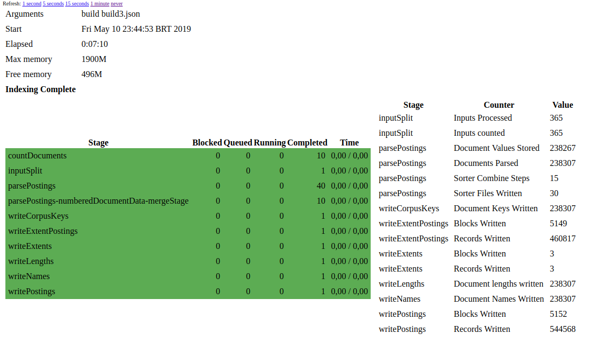
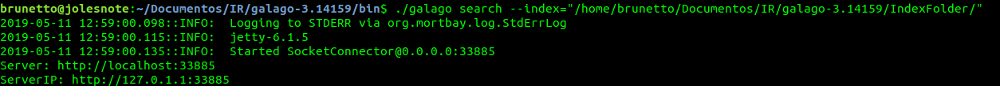
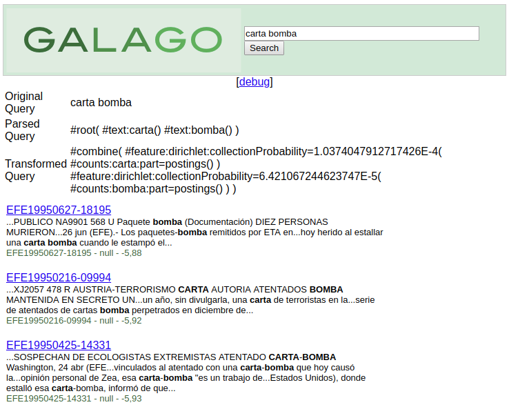

# A Simple tutorial of Galago Information Retrieval

## CMP269 Recuperação de Informações - UFRGS
##### Jonas Brunetto
This is a report of my effort to understand, configure, test and use the **Information Retrieval System Galago**. This word was done as part of CMP269 discipline offered by UFRGS.

#### Index


#### 1 - Introduction
Galago is a toolkit for experimenting with text search. It is based on small, pluggable components that are easy to replace and change, both during indexing and during retrieval.

The Galago Search Engine was originally released as part of "Search Engine, Information Retrieval in Practice" and the Lemur project extends the Galago Search Engine for **research purposes**.

#### 2 - Instalation

Galago Search Engine is based on Java, so his installation is very simple and don't care about your Operation System.

You'll need donwload and unpack the Galago source file [here](https://sourceforge.net/projects/lemur/files/lemur/galago-3.14159/) and have this dependences bellow installed.

- Java 8 or newer
- Maven 3.0 or newer
- Mercurial

After download and unpack, you should compile Galago's source with this command

```
galago-3.14159/bin/galago
```

#### 3 - Indexing

The purpose of storing an index is to optimize speed and performance in finding relevant documents for a search query. Without an index, the search engine would scan every document in the corpus, which would require considerable time and computing power.

To run a index in Galago, you can make a JSON document with your parameters or run passing by argument.

[Here](conf/build.json) is a example of my JSON file that I used to index my collection.

```json
{
    "fileType"  : "trectext",
    "indexPath" : "/home/brunetto/Documentos/IR/galago-3.14159/IndexFolder/",
    "inputPath" : "/home/brunetto/Documentos/IR/Dados/efe95/",    
    "fieldIndex": true,
    "tokenizer" : {
        "class" : "org.lemurproject.galago.core.parse.TagTokenizer",
        "fields"  : ["title", "text"]
    },    
    "distrib"   : 40,
    "mem"       : "2g",
    "mode" : "slurm",
    "port" : 8000,
    "server" : true,
    "stemmedPostings" : false,
    "nonStemmedPostings" : true

} 
```


And here the command used.
```
./galago build build.json
```

Here is a little description about the parameters
```
--inputPath   Can be either a file or directory, and as many can be specified as you like. 
              Galago can read html, xml, txt, arc (Heritrix), warc, trectext, trecweb and
              corpus files.  Files may be compressed (.gz|.bz).

--indexPath   The directory path of the index to produce.

(optional)
--links={true|false}: Selects whether to collect anchor text. default=false
--nonStemmedPostings={true|false}: Selects whether to build non-stemmed inverted indexes. default=true
--stemmedPostings={true|false}: Selects whether to build stemmed inverted indexes. default=true
--stemmer+porter|krovetz: Selects which stemmers to use. default=porter
--corpus={true|false}: Selects to output a corpus folder. default=true
--tokenizer/fields+{field-name}:  Selects field parts to index. omitted by default

(TupleFlow)
--printJob={true|false}: Simply prints the execution plan of a Tupleflow-based job then exits. default=false
--mode={local|fork|slurm}: Selects which executor to use. default=local
--port={int<65000} : port number for web based progress monitoring. default=randomly selected free port
--galagoJobDir=/path/to/temp/dir/: Sets the galago temp dir. default = uses folders specified in ~/.galagotmp or java.io.tmpdir
--deleteJobDir={true|false}: Selects to delete the galago job directory. default = true
--distrib={int > 1}: Selects the number of simultaneous jobs to create. default = 10
--server={true|false}: Selects to use a server to show the progress of a tupleflow execution. default = false
```
**OBS** I didn't use StemmedPosting, because my collections was written in spanish.

Also, the Tokenizer just worked fine for me when I put all token fields in lowercase, even with my collection tags in uppercase.

If you set the parameter _server_ as true, you can follow the process by the URL given.



You can find more information about indexing on Galago at the [Official Documentation](https://sourceforge.net/p/lemur/wiki/Galago%20Indexing/).

#### 4 - Searching

Galago provide a web tool for single searchs, who actually really helps since you don't need comprehend the complex Query Language of galago to make your search.

To access this page, you should run the command `galago search --Index="pathToYourIndex"` 






##### 4.1 Bulk Search

Galago also provide a tool to run multiple queries in on single command. This is helpfull when you are trying evaluate the precision an recall of a software as I in this work.

This command runs a batch of queries against an index and produces TREC-formatted output. The output can be used with retrieval evaluation tools like galago eval (org.lemurproject.galago.core.eval). 

```
galago batch-search

--index=<path_to_index> : Name and path to index.
--requested=N : Number of results to return for each query. default=1000
--operatorWrap=operator : Wrap query text in the specified operator.  
--queryFormat=json|tsv : Accept query file in JSON or TSV format. default=json
--showNoResults=true|false : Print dummy document for queries with no results.  This ensures query evaluation metrics account for queries that returned no result rather than skipping them. A dummy document will appear as follows:
   <qid>  Q0  no_results_found  1  -999  galago
--systemName=system_label : Define run label to a query results list.  Only available in trec mode (--trec=true).  Default value is galago.

<path_to_query_file> : Input JSON parameters file.

Possible additional command line options:
--verbose=true|false : Verbose output. default=false
-caseFold=true : Fold the case of query text or not. default=false
--queryType=simple|complex : Type of query language to be used.default=complex
```

I've tested a several ways to run this command, and the best combinations found was [this one](queries/querie_full.json).

##### 4.2 Stop Words
Since I did found any documentation about how Galago handle with stopwords, and how to change the language (probably, if it exists will be in english) I decided create a Python Script to handle with my document of queries.

This scripts use the lib `nltk` who provides a list of stop words in many languages including spanish.

You'll find this script [here](src/remove_stopwords.py).

##### 4.3 Running
After run my script and create a output I was able to run the batch query against my Index. So here is the command used.

```
./galago batch-search /home/brunetto/PycharmProjects/Galago_Search/queries/querie_full.json --scorer=bm25 > /home/brunetto/Documentos/IR/trec_eval.8.1/test/trec_eval_jonas_python.txt
```

We can observe some thing here, first I'm using the scorer=bm25. I didn't find wich are the scorers are provide by Galago at the Officail Documentation so I'm using bm25 who is one of the most popular in Information Retrieval.

Also I'm sending the output to a document named `trec_eval_jonas_python.txt` to use later to evaluate my results against the relevance document.


#### References
- _https://www.lemurproject.org/galago.php_
- _http://www.search-engines-book.com/_
- _https://sourceforge.net/projects/lemur/_
- _https://github.com/jiepujiang/cs646_tutorials_
- _https://en.wikipedia.org/wiki/Search_engine_indexing_
- _https://medium.com/@lauradietz100/galago-the-secret-documentation-7e1c1b205dda_
